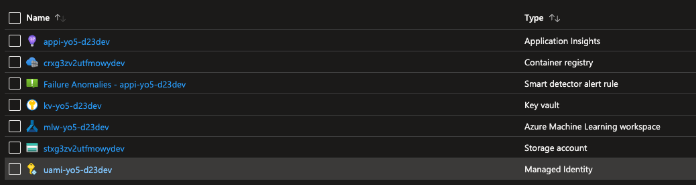
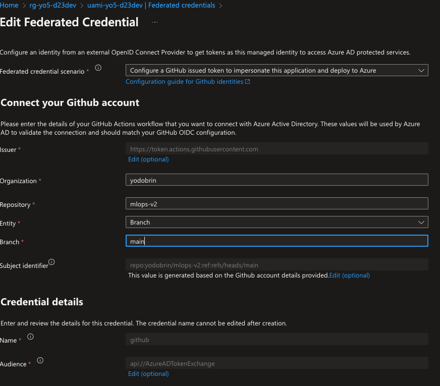
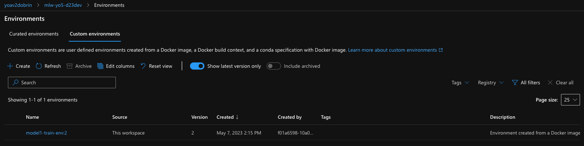
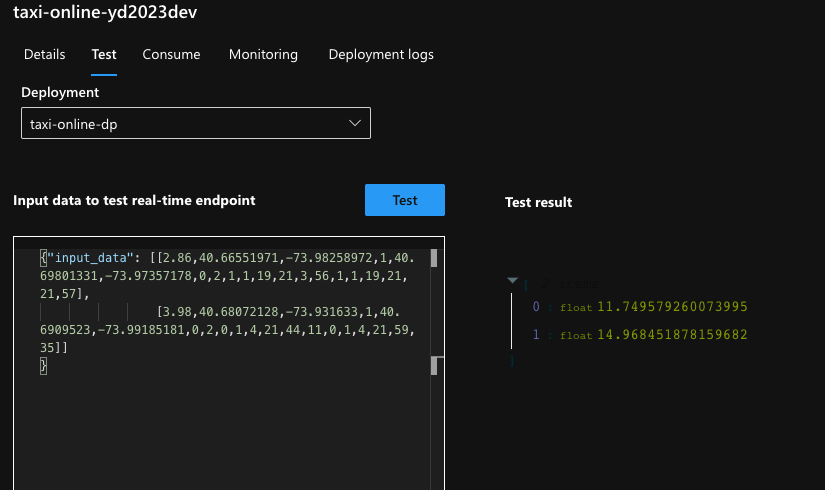
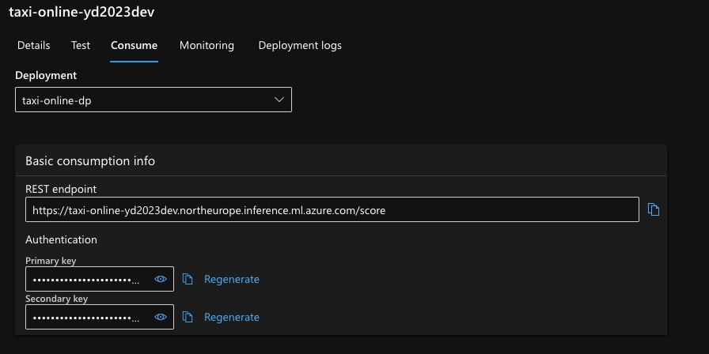

# mlops-v2

> This repository was "forked" from this solution [accelerator](https://github.com/Azure/mlops-v2).

Thinking about MLOps? This repo is a good starting point to get you started with MLOps. The first step is to understand the moving parts of MLOps.
The approach currently leverages few key areas:

- Azure Machine Learning (AML) CLI V2 (az ml) - see our formal docs [here](https://learn.microsoft.com/azure/machine-learning/how-to-configure-cli?tabs=public)

- DevOps pipeline or GitHub actions

- AML CLI (V2) YAML schema - see our [docs](https://learn.microsoft.com/azure/machine-learning/reference-yaml-overview)

This repository provides a starting point to get you started with MLOps. It uses Azure Machine Learning (AML) CLI V2, GitHub actions, and AML CLI YAML schema. To start, clone or fork the repo and follow the steps in the Prerequisites & Setup section. You can work with multiple models, and the directory structure and deployment code should be hosted under the `data-science` and `mlops/azureml` folders, respectively. The GitHub workflows in this repository automate the process of training and deploying a machine learning model using Azure Machine Learning service.


## Table of Contents


- [Prerequisites & Setup](#prerequisites--setup)
   - [0 - Create Resources](#0---create-resources)
   - [0.1 - CLI Setup / Update](#01---cli-setup--update)
   - [1 - Connect to the workspace](#1---connect-to-the-workspace)
   - [2 - Creating / Register an environment](#2---creating--register-an-environment)
   - [3 - Create a compute](#3---create-a-compute)
   - [4 - Submit a training job (prep, train, evaluate, model registeration)](#4---submit-a-training-job-prep-train-evaluate-model-registration)
   - [5 - Deploy the model](#5---deploy-the-model)
   - [6 - Test the model](#6---test-the-model)
- [Working with multiple models](#working-with-multiple-models)
- [Putting it all together](#putting-it-all-together)
    - [Understanding the GitHub workflow](#understanding-the-github-workflow)
    - [Creating a service principal](#creating-a-service-principal)
    - [Running the pipelines](#running-the-pipelines)
- [CLI vs. SDK](#cli-vs-sdk)


## Prerequisites & Setup


Cloning or forking this repo.

### 0 - Create Resources

The following command will create a resource group with all required resources. The resource group will be named `rg-amlv2-<prefix>-<postfix>` and the resources will be named `<prefix>-<postfix>-<env>-<resource>`.

Once the repo is cloned you can run the following command to create the resources, alternatively you could use existing azure machine learning workspace.


This command needs to run from the infrastructure folder. Make sure to update the parameters file with the required values.

```json

{
  "$schema": "https://schema.management.azure.com/schemas/2019-04-01/deploymentParameters.json#",
  "contentVersion": "1.0.0.0",
  "parameters": {
    "prefix": {
      "value": "<your prefix>"
    },
    "postfix": {
      "value": "<your postfix>"
    },
    "env": {
      "value": "<prod/dev/test>"
    },
    "githubOrgOrUser": {
      "value": "<the github user>"
    },
    "githubRepo": {
      "value": "<the forked repository name>"
    },
    "githubBranch": {
      "value": "main"
    },
    "defaultAudience": {
      "value": "api://AzureADTokenExchange"
    }
  }
}
```

```azurecli

az deployment sub create --name <deployment-name> --location <location-of-the-service> --template-file main.bicep --parameters @param.json

```

Once the command is completed, you can find the following resources:



Note for later use the following values:

- resource_group: `<The resource group of aml>`

- workspace_name: `<Azure machine learning workspace name>`

The provided bicep code, is also creating a user assigned identity. It will authorize it as a `contributor` on the resource group. It will also address the federated credentials, where your forked repository will be used to trigger the GitHub actions. Please note, that the subject identifier is branch specific, so if you are using a different branch, you will need to update the token. The provisioning scripts will default the branch to be `main`. This can be done from the portal as well. I am discussing later in this document additional information about the [federated credentials](#authorizing-github-workflows-with-azure).



### 0.1 - CLI Setup / Update

> Run the following commands from the main folder. It is recommended to keep your az extensions up to date.

```azurecli
az extension add -n ml -y
az extension update -n ml
az extension list

```

### 1 - Connect to the workspace

The following commands connects your current session to the aml workspace created in the previous step, you could connect to an existing workspace as well, provide the name and the resource group of the workspace. Ensure that you are connected to the correct subscription.

```azurecli

az login
az account set --subscription <subscription id>
az account show
```

```azurecli
az configure --defaults group=<resource group name> workspace=<workspace name>
```

### 2 - Creating / Register an environment

You could create a docker based environment with conda/pip based dependencies. Per model, you might have different dependencies. The following command will create an environment based on the provided yaml file. The environment will be registered in the workspace. Each time this commands run, it increments the version of the environment.

Lets register an environment, run it from the main folder (docker)

```azurecli
az ml environment create --file ./data-science/models/model-1/environment/model1-train-env.yml

```



### 3 - Create a compute

Now lets create the compute (in case it was not created before) if the cluster is already created you can skip this step (it wont create a second one though)

You can find what compute is already created by running the following command:

```azurecli

az ml compute list
```

Run this to make sure the compute is created:

```azurecli
az ml compute create --name cpu-cluster  --type amlcompute  --size Standard_DS3_v2 --min-instances 0   --max-instances 4   --tier low_priority

```

### 4 - Submit a training job (prep, train, evaluate, model registration)


Now lets run a training job, submitting the job and then opening the web ui to monitor it. In the suggested folder structure, I am using a training pipeline per model. 

(This would work on mac/linux)

```azurecli

run_id=$(az ml job create -f mlops/azureml/train/model1-pipeline.yml --query name -o tsv)

az ml job show -n $run_id --web

```

For windows, you can use the following __powershell__ command:

```powershell

$run_id = az ml job create -f mlops/azureml/train/model1-pipeline.yml --query name -o tsv  
az ml job show -Name $run_id --web  

```

### 5 - Deploy the model

So, we called a pipeline that perform few activities such as preprocessing, training and registering the model. Now the model is registered. The next step would be to deploy an online (not batch) model. We first create an endpoint. You should verify it does not exist before running the following command.

```azurecli

az ml online-endpoint create --name <your endpoint name> -f mlops/azureml/deploy/online/model1-online-endpoint.yml

```

After the endpoint is created we can deploy the model to it.

```azurecli

az ml online-deployment create --name taxi-online-dp --endpoint <your endpoint name> -f mlops/azureml/deploy/online/model1-online-deployment.yml

```

after deployment, we need to route the traffic to the new model. You need to use the same `end-point-name` and `deployment-name` as used in the previous commands.

```azurecli

az ml online-endpoint update --name taxi-online-sf2023dev --traffic "taxi-online-dp=100"
```

### 6 - Test the model

The scoring code is generated during the training of the model. __TBD: how to get the scoring code.__
lets test it

```cli

az ml online-endpoint invoke -n <your endpoint name> --deployment-name taxi-online-dp --request-file data/taxi-request.json
```

You could also test it directly from the web ui.



You could also test it using other platforms, like using the SDK or the rest api.

In the web ui, you can acquire the scoring uri and the api key.



Under the folder /tests you can use the `online.rest` file to test the endpoint. Just ensure to fill in the required `.env` file with the scoring endpoint and the api key.

```env

base_url=<URL of the online/batch end-point>
api_key=<API key>

```


## Working with multiple models


It is a common practice to have multiple models for different scenarios. Each of these models will have different code, environment, compute, etc. In this section we will see how to work with multiple models.

### Directory structure

#### Model specific code

Your model code should be hosted under the ```data-science``` folder. The folder structure is as follows:

```bash
data-science/  
│  
├── models/  
│   ├── model1/  
│   │   ├── code/  
│   │   │   ├── train.py  
│   │   │   └── prep.py
│   │   │   └── evaluate.py
│   │   │   └── register.py 
│   │   ├── environment/  
│   │   │   └── dependencies.yml  
│   │   │   └── model1_environment_docker.yml  
│   │   └── README.md  
│   │  
│   ├── model2/  
│   │   ├── code/  
│   │   │   ├── train.py  
│   │   │   └── prep.py
│   │   │   └── evaluate.py
│   │   │   └── register.py 
│   │   ├── environment/  
│   │   │   └── model2_environment.yml  
│   │   └── README.md  
│   │  
│   └── ...  
│  
└── ...  
```

#### Model specific deployment

The deployment code should be hosted under the ```mlops/azureml``` folder. The folder structure is as follows:

```bash
mlops/
│
├── azureml/
│   ├── deploy/
│   │   ├── batch/
│   │   │   ├── model1_batch-deployment.yml
│   │   │   ├── model1_batch-endpoint.yml
│   │   │   ├── model2_batch-deployment.yml
│   │   │   ├── model2_batch-endpoint.yml
│   │   │   └── ...
│   │   │
│   │   ├── online/
│   │   │   ├── model1_online-deployment.yml
│   │   │   ├── model1_online-endpoint.yml
│   │   │   ├── model2_online-deployment.yml
│   │   │   ├── model2_online-endpoint.yml
│   │   │   └── ...
│   │   │
│   │   └── ...
│   │
│   ├── train/
│   │   ├── model1-pipeline.yml
│   │
│   └── ...
│
└── ...
```


## Putting it all together

We have discussed the required components to build a MLOps pipeline. In this section we will see how to put it all together. We will use the taxi model as an example. The use of GitHUb actions is optional. You can use any other CI/CD tool.

There are several alternatives to start a GitHub workflow, including: 
- Push event: A workflow can be triggered when a commit is pushed to a particular branch of a repository. 

- Pull request event: A workflow can be triggered when a pull request is opened, closed, or synchronized. 

- Scheduled event: A workflow can be triggered at a specific time or on a recurring schedule. 

- Repository dispatch event: A workflow can be triggered by an external event that is sent to the repository. 

- Webhook event: A workflow can be triggered by a custom webhook that is set up to listen for specific events. 

- External trigger: A workflow can be triggered by an external service, such as a continuous integration (CI) system or a deployment tool. 

These are some of the most common alternatives to start a GitHub workflow. Each of them can be configured to suit different use cases and requirements. 


### Authorizing GitHub workflows with Azure

I am using an User assigned identity (UAI) to authorize GitHub workflows with Azure. This approach is recommended for production environments because it provides a higher level of security compared to other approaches. You will not be required to store any credentials in the GitHub repository, which reduces the risk of exposing sensitive information. You will also avoid any credentials rotation issues that may arise from storing credentials in the GitHub repository. The bicep code provided in this repository would create the required resources and assigned it with proper permissions. For further content you could visit this [repository](https://github.com/chgeuer/github-action-via-user-assigned-managed-identity-to-keyvault-secret). Additionally, this is [documented](https://learn.microsoft.com/en-us/azure/active-directory/workload-identities/workload-identity-federation-create-trust-user-assigned-managed-identity?pivots=identity-wif-mi-methods-azp#configure-a-federated-identity-credential-on-a-user-assigned-managed-identity) in the official documentation.

The information required to login into azure while can be stored in the GitHub repository as secrets (none of these are considered secrets). The following secrets are required:

```
AZURE_SUBSCRIPTION - The subscription id
AZURE_TENANT - The tenant id
AZURE_CLIENT_ID - The client id of the user assigned identity
```


### Understanding the GitHub workflow 

The GitHub workflows in this repository are designed to automate the process of:

- Training a machine learning model using Azure Machine Learning service.

- Online and batch deployment of the model using Azure Machine Learning service.

This repo includes two variation of workflows, one type is leveraging composite workflow, and the other type using workflow steps. It would be up-to-you to decide which type to take.

The composite workflows would be more suitable for larger teams, with established Ops team.

Since both types of workflows are using the same set of actions, we will only discuss the composite workflow in this section.

#### Training workflow:  ```deploy-model-training-pipeline-classical.yml``` 

Is designed to deploy a machine learning model training pipeline on Microsoft Azure. In summary, this workflow automates the process of setting up the environment, creating a compute cluster, and running a machine learning model training pipeline on Azure.

The workflow has three main jobs:  

- Register environment: This job checks out the code repository and registers the environment using a YAML file called "train-env.yml". This environment is required for the pipeline to run successfully. The job creates an environment in the Azure Machine Learning workspace specified in the input and the environment is used for training the machine learning model. 

- Create compute: This job checks out the code repository and creates a compute cluster in the same Azure Machine Learning workspace specified in the input. This cluster is used to train the machine learning model. The job uses the resource group and AML workspace name provided in the input to create the compute cluster. 

- Run pipeline: This job checks out the code repository and runs the machine learning model training pipeline using a YAML file called "pipeline.yml". The pipeline is executed on the compute cluster created in the previous job. The job uses the resource group and AML workspace name provided in the input to run the pipeline. 

Overall, the workflow automates the process of setting up the environment, creating a compute cluster, and running a machine learning model training pipeline on Microsoft Azure. This allows for a faster and more streamlined process of deploying a machine learning model on Azure.


#### Deploy to an online endpoint: ```deploy-online-endpoint-pipeline-classical.yml```

Is designed to deploy a machine learning model as online endpoint. The workflow is triggered by a manual event, which prompts the user to input several parameters including the name of the resource group and Azure Machine Learning workspace, the deployment and endpoint files, and the name of the endpoint and deployment.  

The workflow consists of three jobs, each of which runs on a Ubuntu virtual machine. The first job, "create-endpoint", checks out the repository and creates the endpoint using a custom GitHub action. The second job, "create-deployment", checks out the repository and creates the deployment using another custom GitHub action. The third job, "allocate-traffic", checks out the repository and allocates traffic to the deployment using a third custom GitHub action.  

Each job requires the output of the previous job to run, so the "create-deployment" job needs the "create-endpoint" job to finish first, and the "allocate-traffic" job needs the "create-deployment" job to finish first.  

Overall, this workflow automates the process of deploying a machine learning model as an online endpoint on Azure.

#### Deploy to a batch endpoint: ```deploy-batch-endpoint-pipeline-classical.yml```

The inputs for the workflow are the name of the resource group, AML workspace, AML Batch Compute cluster name, deployment file, endpoint file, endpoint name, endpoint type, and deployment name. 

The workflow has three jobs: 
create-compute: This job checks out the code repository and creates a compute cluster in the same Azure Machine Learning workspace specified in the input. This compute cluster is used to run the batch endpoint pipeline. The job uses the resource group and AML workspace name provided in the input to create the compute cluster. 
create-endpoint: This job checks out the code repository and creates an endpoint in the same Azure Machine Learning workspace specified in the input. This endpoint is used to host the batch scoring service. The job uses the resource group, AML workspace name, and endpoint details provided in the input to create the endpoint. 
create-deployment: This job checks out the code repository and creates a deployment in the same Azure Machine Learning workspace specified in the input. This deployment is used to deploy the batch scoring service to the endpoint created in the previous job. The job uses the resource group, AML workspace name, endpoint details, and deployment details provided in the input to create the deployment. 

Overall, the workflow automates the process of creating a compute cluster, an endpoint, and a deployment to deploy a batch endpoint pipeline on Microsoft Azure. This allows for a faster and more streamlined process of deploying a batch endpoint pipeline on Azure.


### Running the pipelines

#### Preparing, Training, Model Registration

As explained previously, the first step include several inner steps, such as preparing data, training and validation and model registration.

The following diagram shows the steps involved in the training pipeline:


#### Online and Batch Deployment

As part of this repository, we have included a GitHub workflow that automates the process of deploying the model as a web service. Follow this document to better understand the key use cases for online and batch deployment. Please review this [document](https://learn.microsoft.com/en-us/azure/machine-learning/concept-endpoints?view=azureml-api-2) to better understand the key use cases for online and batch deployment.


#### Dispatching the workflow - External trigger

All workflows can be triggered manually or via `POST` call to the GitHub Api.

Per workflow file, examine the section that contains this code:

```yaml
  repository_dispatch:
    types: [<trigger-name>]        
```

You should also replace `YOUR_GITHUB_TOKEN`, `OWNER` and `REPO` with the appropriate values.

```curl
curl -X POST \
  -H "Accept: application/vnd.github+json" \
  -H "Authorization: token YOUR_GITHUB_TOKEN" \
  https://api.github.com/repos/OWNER/REPO/dispatches \
  -d '{
    "event_type": "<trigger-name>",
    "client_payload": {
      "resource_group": "<your rg name>",
      "aml_workspace": "<your aml workspace>",
      "cluster_name": "cpu-cluster",
      "environment_file": "./data-science/models/model-1/environment/model1-train-env.yml",
      "node_sku": "Standard_DS3_v2",
      "cluster_size": "4",
      "parameters": "./mlops/azureml/train/model1-pipeline.yml"
    }
}'
```

> Additional authentication methods to the GitHuB api exist but are not in scope of this document.

## CLI vs SDK

As these alternatives are available, you may be wondering which one to use. The following table summarizes the main differences between the v2 CLI and the Python SDK in Azure Machine Learning (AML):

| Aspect | v2 CLI | Python SDK |
| --- | --- | --- |
| Interface | Command line | Code |
| Flexibility | Limited | High |
| Learning curve | Low | High |
| Integration with other tools | Limited | High |
| Compatibility | Windows, macOS, Linux | Python environment required |


- [CLI](https://docs.microsoft.com/en-us/cli/azure/ext/azure-cli-ml/ml?view=azure-cli-latest)

- [SDK](https://docs.microsoft.com/en-us/python/api/overview/azure/ml/?view=azure-ml-py)

The main differences between using the v2 CLI and the Python SDK in Azure Machine Learning (AML) are:

Command line interface vs. code: The v2 CLI provides a command line interface to interact with AML, while the Python SDK allows you to use code to interact with AML.

Flexibility and customizability: With the Python SDK, you have more flexibility and customizability compared to the v2 CLI. You can write your own code and use various Python libraries and frameworks to implement your machine learning workflows. On the other hand, the v2 CLI provides a set of pre-defined commands that you can use to execute common tasks in AML.

Learning curve: The learning curve for the v2 CLI is generally considered to be lower compared to the Python SDK. This is because the v2 CLI is designed to be intuitive and easy to use, with a simple set of commands that can be learned quickly. The Python SDK, on the other hand, requires a higher level of expertise in Python programming.

Integration with other tools: The Python SDK can be integrated with other tools and frameworks, such as Jupyter notebooks, PyCharm, Visual Studio, and many others. This allows you to seamlessly integrate your AML workflows with your existing development environment. The v2 CLI does not have the same level of integration with other tools.

Compatibility: The v2 CLI is compatible with Windows, macOS, and Linux operating systems, while the Python SDK requires a Python environment to be set up on your machine.

In summary, the choice between using the v2 CLI or the Python SDK in Azure Machine Learning depends on your specific needs and level of expertise in Python programming. If you prefer a simple and easy-to-use command line interface, then the v2 CLI may be the best choice for you. If you need more flexibility and customization options, or if you want to integrate your AML workflows with other tools and frameworks, then the Python SDK may be a better fit.
